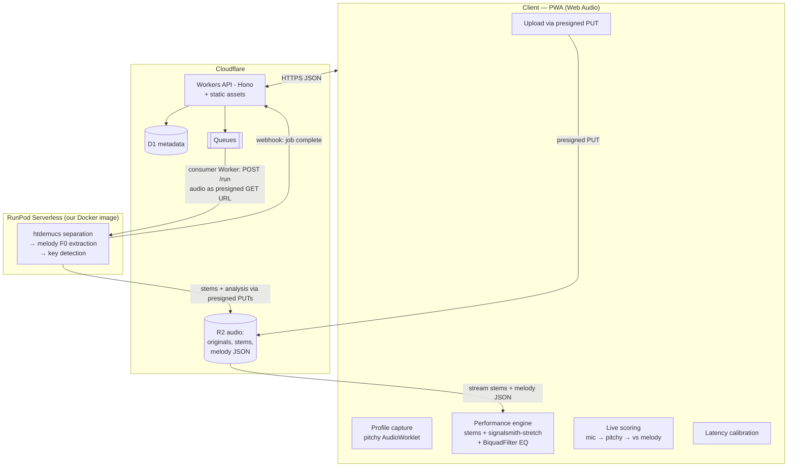

# VoxStage Architecture (v0.1 — Proposed)

Status: proposed via draft PR; becomes the working architecture when Lando merges.
Facts are cited as `Rn` → `docs/RESEARCH.md`. Anything marked **[judgment]** is engineering
judgment pending Phase 0 validation (`docs/ROADMAP.md`).

## 1. Principles

1. **Two planes.** Everything latency-sensitive runs on the client via Web Audio;
   everything heavy runs server-side as async jobs. No real-time audio ever round-trips a
   server.
2. **Cloudflare for everything it can do; RunPod for the one thing it can't.** Cloudflare
   has no GPU path for source separation (R1, R2), so separation + analysis run on RunPod
   serverless GPU, driven over plain HTTPS + webhooks (R12). The GPU vendor is swappable by
   design (Replicate/Modal/managed APIs share the same URL-in/webhook-out contract shape —
   R7, R8, R14).
3. **Audio moves by URL, never through app servers.** Uploads: browser → R2 presigned PUT
   (R3, R4). Processing: RunPod pulls from a presigned GET, pushes results to presigned
   PUTs (R12). Playback: client streams from R2 (egress free — R5).
4. **Portability toward iOS.** The frontend is a plain SPA/PWA (no SSR coupling) so the
   same bundle drops into Capacitor for the App Store later (R24, R25). License choices
   must remain App-Store-safe (R21 → ADR-0004).
5. **Copyright guardrails are architectural** (R31 → ADR-0007): per-user processing only;
   no cross-user dedup/cache of processed audio; no shared catalog; no sharing/export of
   processed copyrighted audio in MVP.

## 2. System overview

## 3. Client performance plane

| Module | Mechanism | Basis |
|---|---|---|
| Stem playback | Web Audio graph; per-stem gain (instrumental up, vocal guide as learning aid) | standard Web Audio |
| Pitch shift ("sync") | `signalsmith-stretch` WASM AudioWorklet; all stems shifted equally, tempo preserved | R20; ADR-0004 |
| EQ | `BiquadFilterNode` peaking/notch to attenuate a profile-flagged problem frequency | R24 |
| Mic capture | `getUserMedia` with `echoCancellation: true`; NO reliance on noiseSuppression/autoGainControl (absent in Safari) | R24 |
| Pitch tracking | `pitchy` (McLeod Pitch Method + clarity gate) in an AudioWorklet | R16, R19; ADR-0005 |
| Scoring | sung F0 vs reference melody contour, time-shifted by calibrated latency offset; octave-tolerant, cents-error based **[judgment — spike S3/S4 tunes it]** | R26 |
| Calibration | onboarding step: play beep → capture via mic → cross-correlate for round-trip offset; seed from `outputLatency`+`baseLatency` where available (Safari 18.4+); warn on Bluetooth audio; fall back to unscored practice mode if calibration fails | R26 |

Recommended shift range: suggestions kept within roughly ±4–5 semitones with a quality hint
beyond **[judgment — artifact threshold validated by ear in Spike S1]**.

## 4. Cloudflare control plane

- **Workers (Hono)** — API + static assets for the SPA. No audio bytes pass through it
  (R3 constraint).
- **D1** — metadata (schema §6).
- **R2** — `originals/{songId}`, `stems/{songId}/{stemType}`, `analysis/{songId}/melody.json`.
  Presigned PUT for upload (R4); short-lived presigned GETs for playback and for RunPod
  input.
- **Queues** — `separation-jobs` producer/consumer; retries + dead-letter queue for failed
  jobs (R6).
- **Secrets** — RunPod API key, R2 signing credentials via Worker secrets; never in the
  client.

**Auth (ADR-0006):** single-method email OTP. D1-backed codes + session tokens
(httpOnly cookie). No social logins — keeps the App Store guideline 4.8 exemption (R27) and
honors the "no multi-auth" pillar.

## 5. RunPod analysis plane

Our own Docker image from `runpod-workers/worker-template` (no official Demucs worker
exists — R11; community reference: `dwin-gharibi/runpod-demucs`). One job does all GPU-side
work for a song:

1. Fetch original from presigned GET URL (payload cap makes inline audio impossible — R12).
2. **Separate** with htdemucs → vocals + instrumental (2-stem for MVP **[judgment]**).
3. **Extract melody** from the vocal stem → F0 contour (time, f0, confidence) as JSON.
   Extractor choice (pYIN vs torchcrepe) decided in Spike S3.
4. **Detect key** and compute the song's vocal pitch distribution (percentile band).
5. Upload artifacts via provided presigned PUT URLs; POST completion webhook to a Worker
   (R12), which updates D1 and notifies the client.

Job contract (shape — final schema in Phase 1):
`in: {job_id, audio_get_url, put_urls{...}, webhook_url, params{stems}}` →
`webhook: {job_id, status, key, vocal_range, melody_url, stem_keys, timings, error?}`.

Cold starts: FlashBoot measured 0.5–42 s on cold endpoints (R10). UX shows an honest
processing state; an always-on worker (-40% — R9) only if volume justifies it later.

## 6. Data model (D1) — sketch, not final DDL

| Table | Key fields | Notes |
|---|---|---|
| `users` | id, email, created_at | email-OTP identity |
| `sessions` | token_hash, user_id, expires_at | httpOnly cookie sessions |
| `otp_codes` | email, code_hash, expires_at, attempts | rate-limited |
| `vocal_profiles` | user_id, range_low_midi, range_high_midi, tessitura_low_midi, tessitura_high_midi, problem_freqs_json, method_version, captured_at | history kept (new row per capture) |
| `songs` | id, user_id, title, artist, r2_key_original, duration_s, status(uploaded→processing→ready→failed), error, created_at | per-user; no cross-user reuse (ADR-0007) |
| `song_stems` | song_id, stem_type, r2_key | |
| `song_analyses` | song_id, key_root, key_mode, melody_r2_key, song_range_low_midi, song_range_high_midi, model_versions_json | contour lives in R2 (too large for a row) |
| `sync_settings` | user_id, song_id, semitones, vocal_guide_gain, eq_json, updated_at | per user per song |
| `performances` | id, user_id, song_id, score, stats_json, latency_offset_ms, created_at | history for progress view |
| `calibrations` | user_id, device_label, offset_ms, measured_at | latest per device used for scoring |

## 7. Key flows

**Upload → ready:** client requests upload slot → Worker creates `songs` row + presigned
PUT → client uploads to R2 → client confirms → Worker enqueues job → Queue consumer POSTs
RunPod `/run` (GET URL for audio, PUT URLs for outputs, webhook URL) → RunPod processes →
webhook → Worker validates job token, updates D1 → client sees `ready`.

**Profile capture:** guided in-browser exercise (sirens/glissando + sustained comfortable
notes) through the pitch tracker → range floor/ceiling + comfortable tessitura band
(percentile-based **[judgment — method versioned in `method_version`]**) → saved to D1.

**Sync recommendation:** compare song melody distribution (e.g., 5th–95th percentile band)
against user tessitura → propose the semitone shift that best centers the melody in the
comfortable band **[judgment — exact objective tuned in Phase 1]** → user fine-tunes →
persist in `sync_settings`.

**Performance session:** load stems + melody JSON → apply shift + EQ + stem mix → calibrate
(or reuse device calibration) → sing; live pitch trace vs melody; post-song accuracy
summary → save to `performances`.

## 8. Security & abuse notes

- Presigned URLs: single-object, short expiry (R4); upload slots size-capped and
  rate-limited per user **[judgment]**.
- Webhook endpoint authenticated via per-job secret token; idempotent completion handling.
- Per-user storage quota to bound R2 cost; original + stems retained, re-derivable
  artifacts cleanable **[judgment]**.
- No audio content leaves a user's account scope (ADR-0007).

## 9. Cost model (estimates — to be measured in Spike S2)

- GPU: derived **<$0.01/song** (R9 pricing × R13 third-party runtimes) — **unmeasured**.
- Managed-API alternative: ~$0.15–0.20/song (R14) — the swappable fallback, 15–20×.
- R2: $0.015/GB-mo, zero egress (R5); Workers Paid $5/mo; Queues ~$0.40/M ops (R6).

## 10. iOS path (post-MVP)

Same SPA in a Capacitor shell. Floor: iOS 14.5 (AudioWorklet — R24), mic via WKWebView
(iOS 14.3 + Info.plist keys — R24), plus a small native `WKUIDelegate` implementation to
avoid per-session mic re-prompts (R25). All licenses App-Store-safe by construction
(ADR-0004). Email-only auth ⇒ no forced Sign in with Apple (R27).

## 11. Known risks

| Risk | Mitigation | Residual |
|---|---|---|
| Combined client DSP load on mid-range phones (playback + WASM shift + mic tracking) | Spike S1 on real devices before any production code | Could force server-side pre-rendered shifts (fallback path exists) |
| Scoring fairness under mobile latency | Designed calibration; Bluetooth warning; unscored practice fallback | Some devices may never score well |
| Cold-start wait on first song | Honest progress UX; active worker if volume justifies | First-song experience slower |
| Separation/extraction quality varies by genre | Spike S2/S3 across genres; set expectations in UX | Some songs will sync poorly |
| Copyright climate shifts | ADR-0007 guardrails; counsel review before public launch | Not eliminable |
